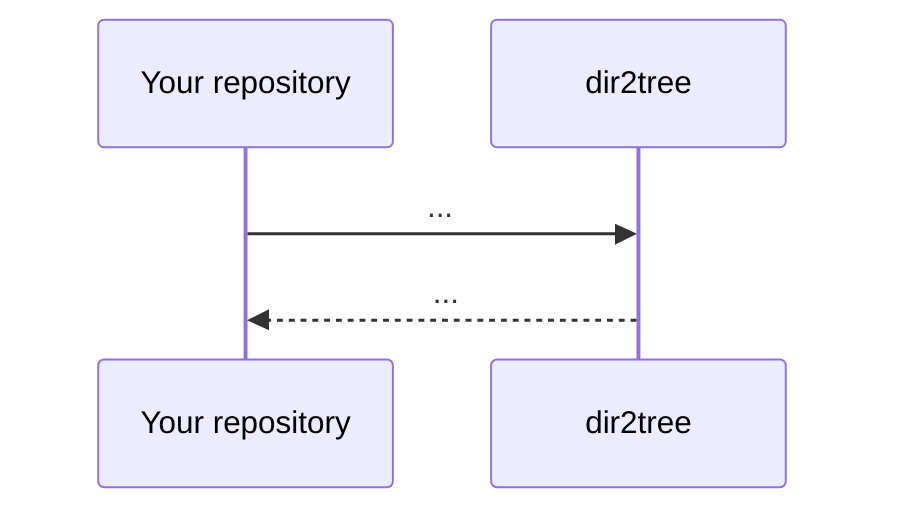

## Demo
[Want to try !](https://replit.com/@zakariaelalaoui/dir2tree#generated.json)
## Install 
```bash
npm install dir2tree
```
## Import
### Common Js
```js
const dir2tree=require("dir2tree")
```
### Es Module
```js
import dir2tree from dir2tree
```
## Syntaxe
### Initialise
```js
const MyTree=dire2tree(ROOT,OPTIONS,CALLBACKS)
MyTree.write(Target,"generated_file.json")
```
#### Arguments
- **`ROOT`** : The path to the root directory that we want handle. it's ***`required`***
- **`OPTIONS`** : An object containing various configuration options to control the behavior of the tree generation.it's ***`optional`*** , These options might include :
  - **`fileContent`** : (***Boolean***)
  - **`fileName`** : (***Boolean***)
  - **`fileExtension`** : (***Boolean***)
  - **`length`** : (***Boolean***)
  - **`size`** : (***Boolean***)
  - **`linesCount`** : (***Boolean***)
  - **`created`** : (***Boolean***)
  - **`lastModified`** : (***Boolean***)
  - **`skip`** :
    - **`folder`** : (***String[]***)
    - **`file`** : (***String[]***)
    - **`extension`** : (***String[]***)
  - **`sortBy`** : (***String***) , possible values : `"names"`,`"extension"`,`"size"`,`"lines"`,`"created"`,`"lastmodified"`,
  - **`order`** : (***Number***)
- **`CALLBACKS`** : it's ***`optional`***
### Methodes
- **`.write(Target, filename)`**
- **`.flat(depth, separator)`**
### Use It in your Github Repository

```yml
name: Generate Directory Tree using zakarialaoui10/dir2tree
on:
  push: 
    branches:
      - main
jobs:
  build:
    permissions :
      contents : write
    runs-on: ubuntu-latest
    steps:
      - name: Checkout code
        uses: actions/checkout@v2
        with:
          ref: ${{ github.head_ref }}
      - name: Generate Directory Tree
        uses: zakarialaoui10/dir2tree@main
      - name: Commit & Push
        run: |
          git config user.name github-actions
          git config user.email github-actions@github.com
          git add -A .
          git commit -m "generated by zakarialaoui10/dir2tree"
          git push
        env:
          CUSTOM_TOKEN: ${{ secrets.CUSTOM_TOKEN }}
          OWNER : ${{github.repository_owner}}
          NAME  : ${{github.event.repository.name}}
```
## License 
This projet is licensed under the terms of MIT License .<br>

